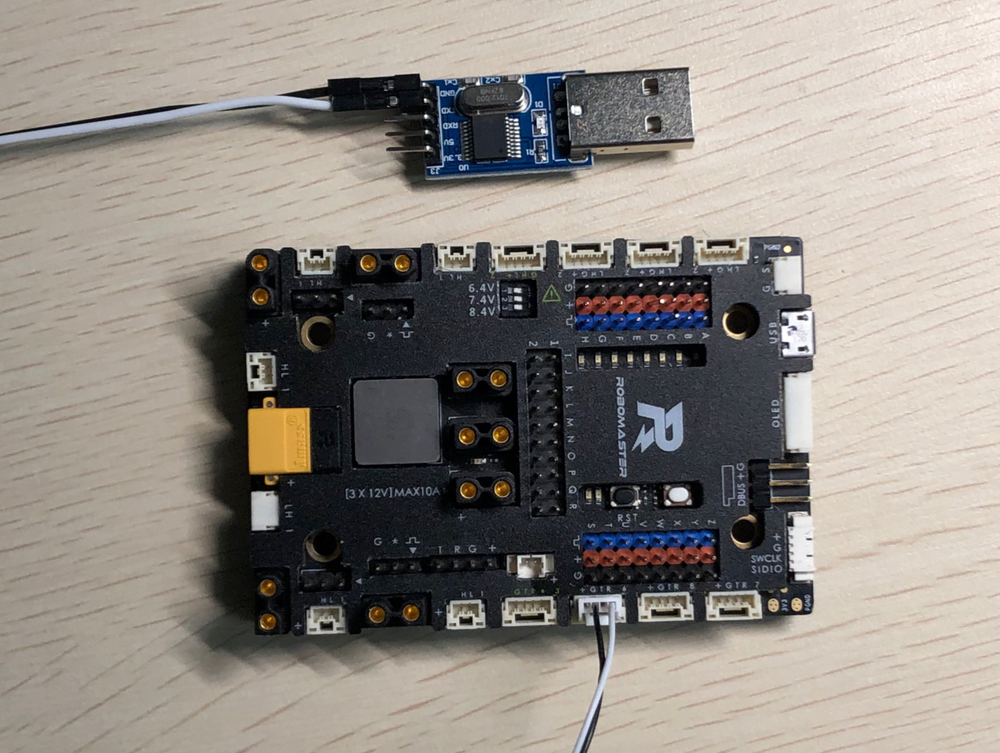

# wtr_serial

> Yunfan REN
>
> renyunfan@outlook.com

GIVE ME A STAR ⭐️⭐️⭐️⭐️⭐️⭐️⭐️ NOW!!!

## Dependencies

```bash
sudo apt-get install ros-${your_ros_version}-serial
```

## Install

```bash
mkdir -p catkin_ws/src
cd catkin_ws/src
git clone git@github.com:RENyunfan/wtr_serial.git
cd ..
catkin_make
```

## Usage

Plug in the USB2TTL module 



and then authorize the serial port

```bash
sudo chmod +777 /dev/ttyUSB0
```

Launch the main node

```bash
cd catkin_ws
source devel/setup.bash
rosrun wtr_serial main
```

Then you just need to publish a message of type`geometry_msgs/Twist` to the topic `/wtr/chassis/twist`  with a recommended rate of `100Hz` to control the chassis. See the example in [./wtr_serial/App/controller.cpp](./wtr_serial/App/controller.cpp)

----------------------------------------------------------------------------------------------------------------------------------------------------------------------------

<font color=red size=24>Attention:Please set the speed in a relative low value, try from 0.1</font>

----------------------------------------------------------------------------------------------------------------------------------------------------------------------------

```cpp
#include <ros/ros.h>
#include "geometry_msgs/Twist.h"
using namespace std;
ros::Publisher twistPub;
int main(int argc, char** argv)
{
    ros::init(argc, argv, "wtr_twist");
    ros::NodeHandle n;
    twistPub = n.advertise<geometry_msgs::Twist>("/wtr/chassis/twist",1);
    ros::Rate loop_rate(100);
    geometry_msgs::Twist speedToPub;
    while(ros::ok())
    {
        speedToPub.angular.z = 0.1;
        speedToPub.linear.x = 0.1;
        speedToPub.linear.y = 0.1;
        twistPub.publish(speedToPub);
        ros::spinOnce();
        loop_rate.sleep();
    }
    return 0;
}

```

## Work with joystick

See more in [joy2twist](https://github.com/RENyunfan/joy2twist)